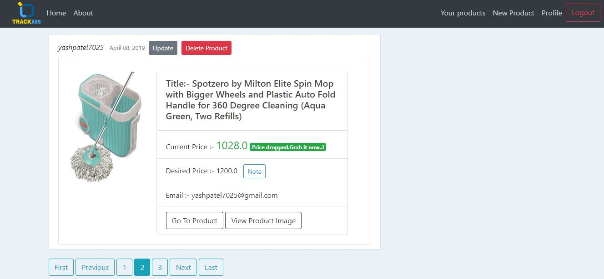
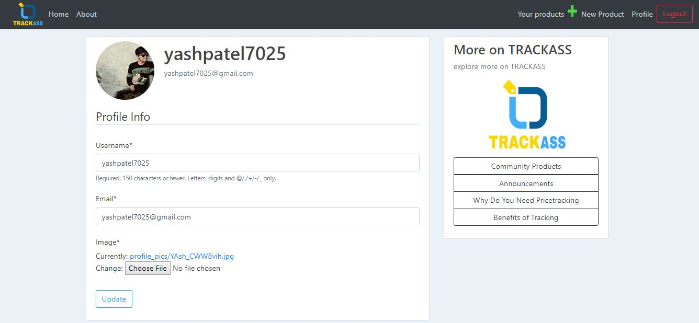
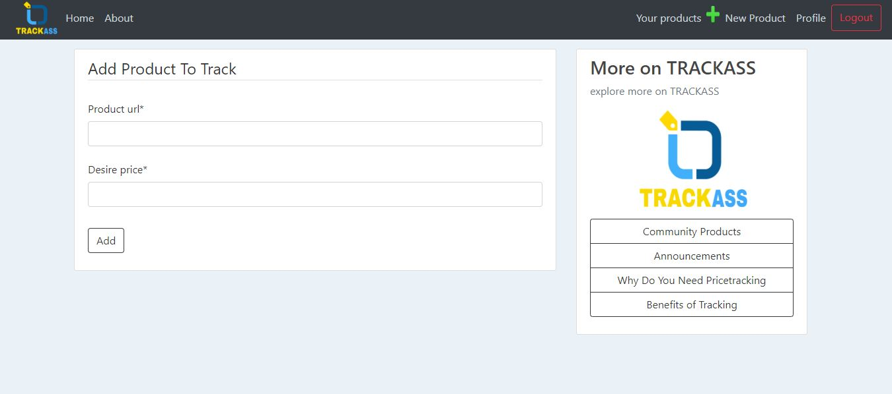

# PriceTracker
Amazon Price tracker using **Python, Django Framework, SQLite, Celery Task Queue and Scrapy Framework**. Frontend is developed using **HTML,CSS,and Bootstrap**

TRACKASS (Amazon Price Tracker) which keeps track of amazon product user want to purchase at a particular price, when price drops to a specified price it **notifies the user via registered email.**
it helps users to **save time** as they don't need to manually open the amazon.in and check drop in price every day, they just need to ***copy the URL of product*** and ***add to tracker***, as soon as price drops user gets notified and can buy product before everyone else does and ***before product gets out of stock***, user can add unlimited products from amazon.in for which he/she wants to track the price.

# Future work
To integrate ``Flipkart.com, AJIO.com, Snapdeal.com `` and other popular e-commerce websites of india

- Total 12 Prodcts are tracked by website for user yashpatel7025, and one of the product that has been tracked is shown below with 
``Name, Price, Product Image``. All fields are scraped from ***Amazon.in*** and it will continue to scrap it ***every 15 minutes***

---

- The Below screen shows that price of the product has been ***reduced*** under ***desired price of the user***, user would have got email alert for the same

---

- The Below screen shows the basic information of the user, ***profile picture*** of the user retrieved from ***Amazon's AWS S3 bucket which is a storage service***

---

- User can easily copy the **link/URL** of the product he/she wants to track from amazon.in, and add it to our website with ***desire price***

